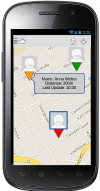
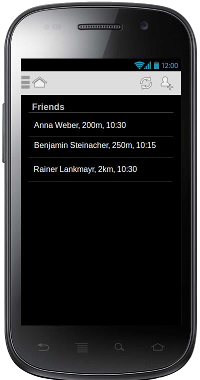
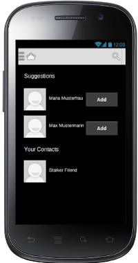

# TrackMe

## Overview
* Let friends track your position
* Show your friends on a map
* share your status via a short message and show availability
* Information shared:
  * Name
  * Location (Distance)
  * Profile Image
  * Timestamp
  * Status

## Technical Details
* Android Version 4.0
* Google Maps API
* GPS Sensors / Google Location API
* Central User Management on Database Server
* On demand location polling
* UI Design Pattern: Action Bar + Navigation
* Drawer

## Mockups

## Git Repo Link
https://github.com/bodedejavu/sw14_free_29

## Presentation
[TrackMe.pdf](https://github.com/bodedejavu/sw14_free_29/raw/master/presentations/TrackMe.pdf)
