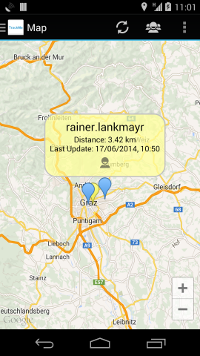
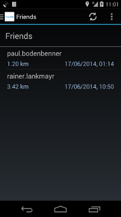
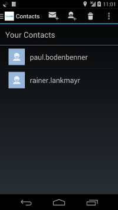

# TrackMe

## Overview
* Let friends track your position
* Show your friends on a map
* share your status via a short message and show availability
* Information shared:
  * Name
  * Location (Distance)
  * Timestamp

## Technical Details
* Android Version 4.0
* Google Maps API v2
* Google Location API (GPS Sensors, WiFi, cell info)
* Central User Management on Database Server
* Background location updating
* UI Design Pattern: Action Bar + Navigation Drawer

## Mockups

## Screencast

## Screenshots

## Presentation
[TrackMe.pdf](https://github.com/bodedejavu/sw14_free_29/raw/master/presentations/TrackMe.pdf)
